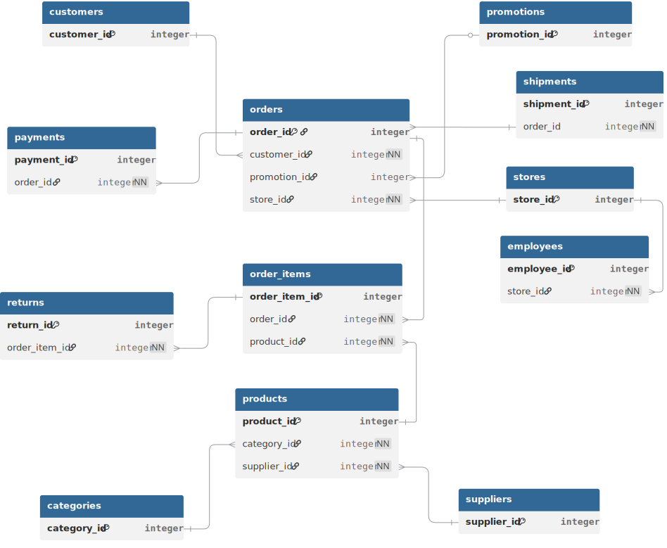

# Database Schema

## Overview

The Marvolo Retail database consists of 12 relational tables that model the complete retail order lifecycle.

The schema follows a normalized relational design and can be divided into three logical groups:

- Master Data
- Transaction Data
- Supporting Transaction Data

---

## Entity Classification

| Group | Tables |
|--------|--------|
| Master Data | customers, stores, employees, products, categories, suppliers, promotions |
| Transaction Data | orders, order_items |
| Supporting Transaction Data | payments, shipments, returns |

---

## Entity Relationship Diagram

---

## Design Notes

- Orders is the central transactional entity.
- Order Items stores the line-level details of each order.
- Products belong to exactly one category and one supplier.
- Payments, Shipments and Returns extend the order lifecycle.
- Promotions are optional for each order.