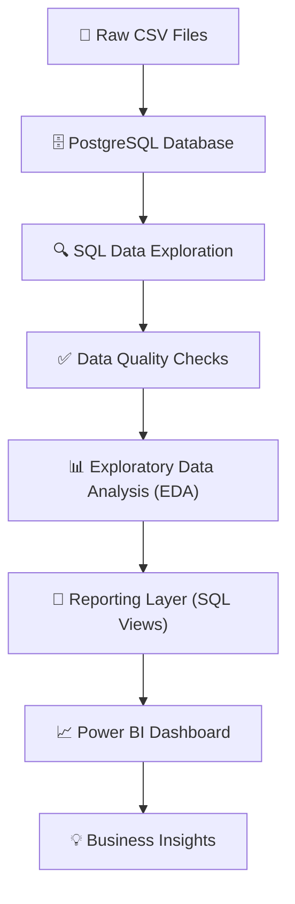

# System Architecture

## Overview

The Retail Finance Analytics project follows a layered data analytics architecture. The workflow starts from raw transactional CSV files and progresses through data storage, validation, exploration, reporting, and dashboard visualization before producing business insights.

## System Architecture

This project loads raw retail CSV files into PostgreSQL, where SQL is used to profile, validate, and explore the data. Analytical SQL views then transform raw tables into business-ready metrics, which power interactive Power BI dashboards.This layered architecture separates raw data, analytical logic, and visualization, making the project easier to maintain and extend. The result is a clear pipeline from raw data to decision-ready insights.